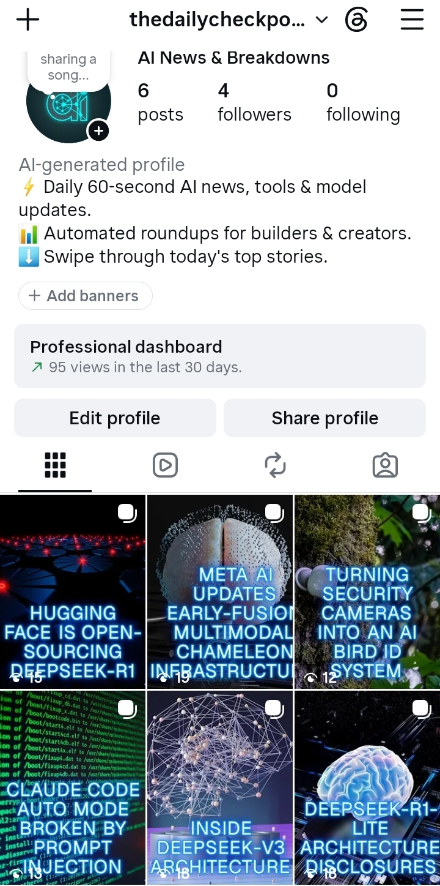

# AgentKit Collection (5 flows)

This AgentKit contains 5 flows:

1. **run-execute-pipeline** (`flows/run-execute-pipeline.ts`)
2. **collect-sources** (`flows/collect-sources.ts`)
3. **visual-planner** (`flows/visual-planner.ts`)
4. **draft-content** (`flows/draft-content.ts`)
5. **curate-pick** (`flows/curate-pick.ts`)

# AI News Carousel

Pulls the latest AI news from arXiv, GitHub, Hacker News, and a
search-grounded Gemini query, ranks and verifies it against duplicates,
drafts a 6-slide Instagram carousel with real photos and a caption, and
delivers it to a review dashboard every 8 hours -- fully automated up to
the point of actually posting, which stays a deliberate human decision.

## How it works

1. **collect-sources** -- pulls fresh items from arXiv, GitHub trending,
   Hacker News, and a Gemini search-grounded query.
2. **curate-pick** -- ranks items by significance, checks corroboration
   across sources, and dedupes against the last 5 days of picks.
3. **draft-carousel-content** -- writes the 6-slide copy plus caption and
   hashtags (fixed slide roles: hook / what / why / how_1 / how_2 / cta).
4. **visual-planner** -- sources a relevant background photo per slide via
   Unsplash.
5. **run-execute-pipeline** -- the orchestrator; runs on a schedule, chains
   the above, and sends the finished draft to the review app.

The app (`apps/`) is a Next.js dashboard that receives each drafted digest
via webhook, renders the 6 slides as real downloadable PNGs (via
`@vercel/og`), and lets a human mark it posted or skipped.

## Setup

### 1. Deploy the flows
Import each flow in `flows/` into Lamatic Studio and deploy it. Note each
flow's ID from its details panel.

### 2. Configure credentials
In Studio, add credentials for:
- An OpenAI-compatible model/ Gemini for ranking and drafting
- Gemini, with search grounding enabled, for source collection
- An Unsplash API access key

### 3. Wire the orchestrator
In `run-digest-pipeline`, replace the `<...deployed flow ID>` placeholders
in each Execute Flow node with your real flow IDs from step 1. Set a
Schedule Trigger (every 8-6 hours recommended). Keep a manual trigger during
initial testing rather than starting on the schedule immediately.

### 4. Deploy the app
```bash
cd apps
cp .env.example .env.local   # fill in real values
npm install
npm run dev                   # or deploy to Vercel
```

You'll need:
- An Upstash Redis database (Vercel dashboard -> Storage -> Marketplace
  Database Providers -> Upstash -> Redis, free tier)
- A shared secret, set as `INGEST_SHARED_SECRET` in the app's env AND
  matched in `run-execute-pipeline`'s final Code Node

### 5. Point the pipeline at your deployed app
In `run-digest-pipeline`'s final Code Node, set `APP_INGEST_URL` to your
deployed app's `/api/ingest-digest` URL.

## Review workflow
Open the deployed app. Each pending digest shows its 6 rendered slides,
caption, and hashtags. Download individually or as a zip, post manually
to Instagram, then mark it posted or skipped in the dashboard.

## Notes
- This kit never posts automatically -- delivery to the review dashboard
  is the final automated step by design.
- Image sourcing uses Unsplash's free API; per their terms, using an
  image triggers a usage-tracking ping automatically.

## Live demo
[ai-digest-app-two.vercel.app](https://ai-digest-app-two.vercel.app/)

## Example output
